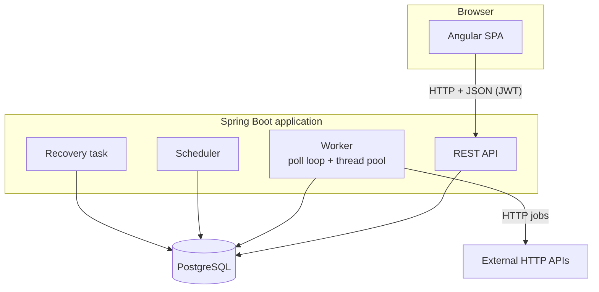
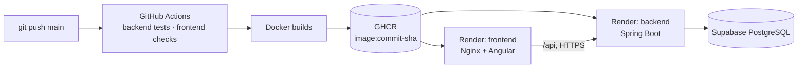

# FlowForge — Architecture

| | |
|---|---|
| Related | [FRS.md](FRS.md) · [database.md](database.md) · [api.md](api.md) · [execution-engine.md](execution-engine.md) · [roadmap.md](roadmap.md) |

---

## 1. Overview

FlowForge is a modular monolith: an Angular single-page application, one Spring Boot application, and one PostgreSQL database. The execution engine (worker, scheduler, recovery task) runs inside the Spring Boot application as background components.



**The API and the worker communicate only through PostgreSQL.** The API writes executions and jobs. The worker claims jobs and records their results. There are no in-memory calls or internal events between them. Because of this, several application instances can share the workload safely without a message broker, and the worker can later run in separate processes without code changes (§9).

A single application is used instead of separate services because creating an execution and all of its jobs must be one database transaction. Splitting workflow management and execution into separate services would turn that transaction into a distributed consistency problem with no benefit at this scale.

---

## 2. Backend application

The Spring Boot application contains:

- **REST API**: CRUD for projects, workflows, steps and schedules; starting and cancelling executions; read endpoints for the UI. All input validation, ownership checks and transaction boundaries live here.
- **Worker**: a poll loop and a fixed pool of 4 job threads. It repeatedly claims runnable jobs from PostgreSQL, runs their handlers, and records outcomes. It can be disabled with `flowforge.worker.enabled=false` for API-only instances.
- **Scheduler**: a `@Scheduled` task (every 15 s) that creates executions for due cron schedules.
- **Recovery task**: a `@Scheduled` task (every 30 s) that finds jobs whose lease expired, meaning the worker stopped mid-attempt, and retries or fails them.

The engine is implemented directly in the application rather than on a job framework such as JobRunr or Quartz. The claiming, retry, recovery and dependency semantics are specific to workflows and need to be explicit and fully under the application's control. JobRunr may be evaluated later for comparison.

The scheduler and recovery task are safe to run in every instance at the same time. They coordinate through row locks and unique constraints, so no leader election or distributed lock service is needed. Engine details are in [execution-engine.md](execution-engine.md).

---

## 3. Backend structure

The code is organized by technical layer:

```text
com.flowforge
├── entity/        JPA entities and their status enums (e.g. Workflow, WorkflowStep, WorkflowStatus)
├── repository/    Spring Data JPA repositories (e.g. WorkflowRepository)
├── service/       use cases, transactions, ownership checks (e.g. WorkflowService)
│   └── engine/    worker, job runner, outcome recording, job handlers, placeholder resolver
├── controller/    REST controllers: HTTP mapping and DTO validation only (e.g. WorkflowController)
├── security/      authentication, JWT, security configuration, current-user resolution
├── exception/     error handling (ProblemDetail) and error codes
├── dto/           request and response records
└── config/        application configuration classes
```

Dependencies between layers point one way: `controller → service → repository → entity`. Controllers exchange `dto` types with clients and never access repositories directly. Formal module frameworks (Spring Modulith, hexagonal ports and adapters, multi-module Maven) aren't used, because package conventions are sufficient for a codebase of this size.

Where the main rules live:

| Rule | Location |
|---|---|
| Acyclic dependencies, placeholders referencing only ancestors | `WorkflowGraph` (plain Java) |
| Allowed state transitions | Status enums and entity methods |
| Copying steps into jobs when an execution starts | `ExecutionService` |
| Claiming, outcome recording, unlocking dependents | `JobQueue` (SQL) and `ExecutionCoordinator` |
| Performing HTTP calls and delays | `JobHandler` implementations |
| Retry delay | `RetryPolicy` (plain Java) |
| Next cron time | `CronSchedule` (wraps Spring's `CronExpression`) |

---

## 4. Data access and transactions

- **Spring Data JPA** is used for CRUD and read queries.
- **Explicit SQL** (`JdbcClient` or native `@Query`) is used for the engine queries where locking must be precise and visible: claiming, outcome recording and recovery. Hibernate's dirty checking and first-level cache would obscure their behavior.
- **Transactions** are declared on service methods. **No transaction is open while a job performs external I/O.** Each attempt uses short transactions before and after the handler call.
- **Flyway** owns the schema (`spring.jpa.hibernate.ddl-auto=validate`). `spring.jpa.open-in-view=false`.
- **Optimistic locking** (`@Version`) protects workflow metadata against concurrent edits. **Pessimistic row locks** are used where concurrent machine updates must be serialized: the workflow row during dependency edits, and the execution row during engine updates.

**Errors:** Bean Validation on request DTOs (`400`). Domain exceptions for rule violations (`409`, `422`). A single `@RestControllerAdvice` maps everything to Spring's `ProblemDetail` with an additional `code` field (see [api.md §2.1](api.md#21-error-format)). Named database constraints are mapped to specific `409` codes.

**Logging and health:** while a job runs, log lines carry `executionId`, `jobId` and `attempt` through SLF4J MDC. Together with the attempt history stored in the database, this is enough to diagnose a failed execution. Spring Boot Actuator exposes `/actuator/health`.

---

## 5. Security

```text
Request → JWT filter (valid token → user id in SecurityContext)
        → Controller (@Valid DTO)
        → Service: repository.findByIdAndOwner(id, currentUserId) → empty → 404
        → business logic, transaction commit
```

- **Authentication**: stateless JWT (HS256, secret from an environment variable, 60-minute expiry). Passwords are hashed with bcrypt.
- **Authorization** is ownership-based: every lookup includes the owning user, so another user's resource is indistinguishable from a missing one (`404`). There are no roles in the MVP. An `ADMIN` role can be added later without structural changes.
- The worker, scheduler and recovery task run in-process on rows the owner already created, so they don't need their own authentication.
- HTTP jobs execute user-supplied URLs. `HttpJobHandler` rejects private, loopback, link-local and cloud-metadata addresses before sending a request (SSRF protection, [execution-engine.md §14](execution-engine.md#14-job-handlers)).
- Login and registration are rate limited in Nginx (10 per minute per client IP, bursts of 5) and answer `429` with a `TOO_MANY_REQUESTS` problem body. The limit is per Nginx instance, which is exact with the single-VM deployment.

---

## 6. Frontend

```text
src/app/
├── core/        AuthService, authInterceptor, errorInterceptor, authGuard, layout
├── shared/      status badge, confirm dialog, JSON viewer, duration pipe
└── features/
    ├── auth/        login, register
    ├── projects/    list, detail
    ├── workflows/   workflow page, step form, dependency picker, validation messages
    ├── executions/  list, detail, job detail, run dialog
    └── schedules/   schedule list and form
```

- Standalone components with lazy-loaded routes. Angular Material for tables, dialogs and forms.
- One API service per feature returns Observables. Components don't build URLs.
- Page state is held in signals inside the page component or a page-scoped service. There is no global store (NgRx), because each screen owns its data and nothing needs cross-page synchronization.
- RxJS handles HTTP, route-parameter changes (`switchMap`) and polling.
- Reactive forms. The step form swaps its config fields by job type.
- `authInterceptor` adds the bearer token and logs out on `401`. `errorInterceptor` shows server and network errors. Field-level `400` errors are shown inline.
- In development, `ng serve` proxies `/api` to the backend, and in production Nginx does the same. The app is therefore always same-origin and needs no CORS configuration.

---

## 7. Real-time updates

The execution detail page polls `GET /api/executions/{id}` every 2 seconds while the execution is `RUNNING`, and stops once it has finished.

Polling is used because it is simple and works unchanged across multiple application instances: any instance can answer from the database. Server-Sent Events are a possible later improvement. With a single instance they could be driven by in-process events after commit. With multiple instances, events would have to cross processes (for example through PostgreSQL `LISTEN/NOTIFY`), which is added complexity that is only justified by a real need. WebSockets aren't needed, because updates flow only from server to browser.

---

## 8. Deployment

### Local development

Docker Compose (`docker-compose.yml`) runs PostgreSQL, Mailpit, the backend image and the frontend image. Nginx in the frontend image serves the Angular build and proxies `/api` and `/actuator/health` to the backend, so the browser only ever talks to one origin. For work in the IDE, only `postgres` and `mailpit` are started and `ng serve` proxies instead. Secrets come from a root `.env` that is gitignored; the backend reads the same file outside Docker.

### CI/CD and production



| Stage | Implementation |
|---|---|
| CI | Every push and pull request: `./mvnw verify` (Testcontainers PostgreSQL), frontend format check, tests and production build. |
| Images | Built after both checks pass. On `main` only, pushed to GHCR as `flowforge-backend` and `flowforge-frontend`, tagged with the commit SHA (and `latest`). The backend image carries the SHA, shown at `/actuator/info`. |
| Deploy | On `main` only. Render deploy hooks are called with the exact SHA image, backend first. CI waits until `/actuator/info` reports that SHA, then deploys the frontend and checks the page and the proxied health endpoint. |
| Runtime | Two Render free web services running the published images (`render.yaml`). The frontend's Nginx proxies `/api` to the backend's public HTTPS URL (`FLOWFORGE_API_URL`), so there is no CORS and the same image runs locally and on Render. |
| Database | Managed PostgreSQL on Supabase, reached through its session pooler over SSL. Flyway migrates on startup. |
| Secrets | Render environment variables (`FLOWFORGE_DB_URL`, `FLOWFORGE_DB_USERNAME`, `FLOWFORGE_DB_PASSWORD`, `FLOWFORGE_JWT_SECRET`) and GitHub secrets for the deploy hooks. Nothing in git. |

Render health checks use `/actuator/health`, which includes the database, so a deploy with broken database settings never becomes live.

**Free-tier trade-offs.** Render free services sleep after 15 minutes without traffic and share 750 instance hours per month. A cold backend start takes a few minutes on 0.1 CPU; the image uses a small heap, the serial GC and the C1 compiler to fit 512 MB and halve startup time. While the backend sleeps, the worker and scheduler sleep too: due schedules fire once when it wakes ([execution-engine.md §12](execution-engine.md#12-scheduling)), not at their exact time. Render free blocks outbound SMTP on ports 25, 465 and 587, so EMAIL steps need a provider on port 2525. A Render static site would avoid the second sleeping service, but it is built from source instead of the GHCR image and loses the Nginx rate limiting.

**Self-hosted alternative.** The Compose profile `production` adds Caddy (automatic Let's Encrypt HTTPS) and a nightly `pg_dump` backup container for running everything on one VM.

| Image | Build | Runtime |
|---|---|---|
| `backend/Dockerfile` | JDK + Maven wrapper, `package`, then Spring Boot's layered extraction | JRE only, non-root user, listens on `$PORT` (default 8080), memory settings for 512 MB, health check on `/actuator/health` |
| `frontend/Dockerfile` | Node, `npm ci`, production build | Nginx from a template: port `$PORT`, backend `FLOWFORGE_API_URL` (default `http://backend:8080`), SPA fallback, rate limits, long caching for hashed JS/CSS |

The `demo` profile seeds a demo user and three example workflows that call the application's own demo endpoints. Seeding runs once and is skipped when the demo user already exists.

---

## 9. Multiple instances

The same application can run as several instances against one database without code changes:

- Job claiming uses `SELECT … FOR UPDATE SKIP LOCKED`, so instances never claim the same job.
- Outcome recording is serialized per execution by a row lock and fenced by the attempt number.
- Recovery and scheduling use row locks and unique constraints, so they are safe to run everywhere.
- The UI polls, so any instance can serve status requests.

Instances can optionally be split by role: API-only instances set `flowforge.worker.enabled=false`, and other instances run the worker.

Every attempt records the worker that ran it as `hostname:pid:flowforge-job-<n>`, so the job history shows which instance and thread did the work. With Docker Compose, `docker compose up --scale backend=2` runs two instances behind the same Nginx, which resolves the `backend` service name through Docker's DNS and spreads requests across both. An integration test starts a second Spring context against the same PostgreSQL and verifies that 30 executions are shared with every job running exactly once, that concurrent schedulers fire each due time once, and that a job left behind by one instance is recovered and finished by the other.

---

## 10. Technology decisions

| Technology | Reason |
|---|---|
| Java 21, Spring Boot, Spring Data JPA, Flyway, Bean Validation | Core stack |
| PostgreSQL | System of record and job queue. Queue state and job state must stay transactionally consistent, so both live in the same database. |
| `SELECT … FOR UPDATE SKIP LOCKED`, row locks | Correct concurrent job claiming and engine updates |
| Spring Security, JWT, bcrypt | Authentication and ownership |
| Angular, RxJS, signals, Angular Material | Frontend |
| JUnit 5, Testcontainers, WireMock | Locking and concurrency must be tested against real PostgreSQL, not H2 |
| GitHub Actions | Build and test on every push |
| JSONata library, Mailpit | TRANSFORM and EMAIL job types |
| Docker images, Nginx | Containerized deployment |
| Render, Supabase | Free hosting for the two images and managed PostgreSQL |
| Caddy | HTTPS with automatic Let's Encrypt certificates (self-hosted VM option) |
| Server-Sent Events | Only if polling proves inadequate |
| JobRunr | The engine is implemented in-application |
| Prometheus, Grafana | Logs and health checks suffice initially |
| Redis | Queue, locks and coordination are covered by PostgreSQL at this scale. Only reconsidered for a measured need, such as exact rate limits across instances. |
| Kafka, RabbitMQ | A broker would be a second source of truth that must stay consistent with job state |
| Microservices | Would turn local transactions into distributed ones |
| Kubernetes, service mesh | A single VM with Docker Compose is sufficient |
| Event sourcing, CQRS | Relational state plus attempt history provides full traceability |
| Distributed lock services | PostgreSQL row locks and leases are sufficient |
| NgRx | State is page-scoped |

---

## 11. Open decisions

| Decision | Options | Current preference |
|---|---|---|
| JWT implementation | Spring OAuth2 Resource Server (`NimbusJwtDecoder`) vs custom filter + `jjwt` | Resource Server (less custom security code) |
| JWT storage in the browser | `localStorage` vs in-memory + refresh cookie | `localStorage` initially. The in-memory variant arrives with refresh tokens. |
| Worker threads | Fixed pool vs virtual threads | Fixed pool of 4 |
| Workflow graph in the UI | Dependency list vs rendered graph | Decided: both. The step list stays, and a left-to-right graph (`@dagrejs/dagre` layout, plain SVG) is shown on the workflow page and on execution pages, colored by job status. |
