# FlowForge — Database Design

| | |
|---|---|
| Database | PostgreSQL 16+ · Flyway migrations · Spring Data JPA (Hibernate 6) |
| Related | [FRS.md](FRS.md) · [architecture.md](architecture.md) · [execution-engine.md](execution-engine.md) · [api.md](api.md) |

---

## 1. Tables at a glance

| Table | Purpose |
|---|---|
| `"user"` | Accounts |
| `project` | Groups workflows. Carries ownership. |
| `workflow` | Workflow definition |
| `workflow_step` | Steps of a workflow definition |
| `workflow_dependency` | "Step B depends on step A" edges |
| `workflow_execution` | One run of a workflow |
| `job_execution` | One step inside one run. **Also the job queue.** |
| `job_attempt` | One try at running a job |
| `workflow_schedule` | Cron schedules |

**Nine tables.** Candidates evaluated and left out:

| Candidate | Decision |
|---|---|
| `job_execution_dependency` (copying the edges for each run) | **Removed.** Replaced by a `depends_on text[]` column on `job_execution` (§3.8). |
| `worker` (registry of live workers) | **Not needed.** Crash recovery uses per-job leases, not a worker table. |
| `audit_log` | **Later.** `job_attempt` + execution history already explain what the engine did. |
| `project_secret` (encrypted API tokens) | **Later** (see FRS NFR-S3) |
| `refresh_token` | **Later** |
| `role` / permission tables | **Not needed.** The MVP has no roles. Later a single `role` column is enough. |
| Workflow version tables | **Not needed.** Jobs keep a copy of their step config instead (§3.8). |

---

## 2. ER diagram

```mermaid
erDiagram
    user ||--o{ project : owns
    project ||--o{ workflow : contains
    workflow ||--o{ workflow_step : has
    workflow_step ||--o{ workflow_dependency : "waits (step_id)"
    workflow_step ||--o{ workflow_dependency : "is waited for (depends_on_step_id)"
    workflow ||--o{ workflow_schedule : has
    workflow ||--o{ workflow_execution : "runs as"
    workflow_schedule |o--o{ workflow_execution : triggered
    user |o--o{ workflow_execution : triggered
    workflow_execution ||--|{ job_execution : contains
    job_execution ||--o{ job_attempt : "tried as"

    user {
        bigint id PK
        varchar email UK
        varchar password_hash
        varchar display_name
        timestamptz created_at
    }
    project {
        bigint id PK
        bigint owner_id FK
        varchar name
        varchar description
        timestamptz created_at
        timestamptz updated_at
    }
    workflow {
        bigint id PK
        bigint project_id FK
        varchar name
        varchar description
        varchar status "DRAFT, ACTIVE, ARCHIVED"
        int execution_count
        bigint version
        timestamptz created_at
        timestamptz updated_at
    }
    workflow_step {
        bigint id PK
        bigint workflow_id FK
        varchar step_key "unique per workflow"
        varchar name
        varchar job_type "HTTP, DELAY"
        jsonb config
        int timeout_seconds
        int max_attempts
        int retry_delay_seconds
        timestamptz created_at
        timestamptz updated_at
    }
    workflow_dependency {
        bigint workflow_id FK
        bigint step_id PK
        bigint depends_on_step_id PK
    }
    workflow_schedule {
        bigint id PK
        bigint workflow_id FK
        varchar cron_expression
        varchar timezone
        jsonb input
        boolean enabled
        timestamptz next_run_at
        timestamptz last_run_at
    }
    workflow_execution {
        bigint id PK
        bigint workflow_id FK
        int run_number
        varchar status "RUNNING, SUCCEEDED, FAILED, CANCELLED"
        varchar trigger_type "MANUAL, SCHEDULE"
        bigint triggered_by FK
        bigint schedule_id FK
        timestamptz scheduled_for
        varchar dedup_key
        jsonb input
        varchar error_summary
        timestamptz created_at
        timestamptz finished_at
    }
    job_execution {
        bigint id PK
        bigint workflow_execution_id FK
        varchar step_key
        varchar step_name
        varchar job_type
        jsonb config "copy of the step"
        text_array depends_on "step keys"
        int timeout_seconds
        int max_attempts
        int retry_delay_seconds
        varchar status
        int attempt_count
        timestamptz available_at
        varchar locked_by
        timestamptz lease_expires_at
        jsonb output
        text last_error
        timestamptz created_at
        timestamptz started_at
        timestamptz finished_at
    }
    job_attempt {
        bigint id PK
        bigint job_execution_id FK
        int attempt_number
        varchar status "RUNNING, SUCCEEDED, FAILED, ABANDONED"
        varchar worker_id
        timestamptz started_at
        timestamptz finished_at
        varchar error_type
        text error_message
        boolean retryable
    }
```



---

## 3. Tables

Conventions:

- IDs are `bigint GENERATED ALWAYS AS IDENTITY`, mapped to `Long` with `@GeneratedValue(strategy = GenerationType.IDENTITY)`. IDs are sequential and therefore guessable, which is harmless because every lookup is scoped by owner (§4).
- Timestamps are `timestamptz`.
- Enums are `varchar` + `CHECK (… IN (…))`, mapped with `@Enumerated(EnumType.STRING)`. Adding a value is then a normal migration. PostgreSQL `ENUM` types are harder to change.
- Constraint names are explicit (`uq_…`, `fk_…`, `ck_…`) so the error handler can turn a violated constraint into a clear `409`.
- **Cascade inside a group, restrict across groups:** deleting a workflow step deletes its dependency rows, but nothing ever silently deletes executions.

### 3.1 `"user"`

- **Purpose:** someone who can log in. `user` is a reserved word in PostgreSQL, so the table name is always quoted (`"user"`). The JPA entity is `User` (`@Table(name = "\"user\"")`).
- **Fields:** `email varchar(254) NOT NULL`, `password_hash varchar(100) NOT NULL` (bcrypt), `display_name varchar(100) NOT NULL`, `created_at`.
- **Constraints:** unique index `uq_user_email` on `lower(email)`, so `Ana@x.com` and `ana@x.com` are the same account.
- **Later:** `role varchar(16) DEFAULT 'USER'` when an admin role is added.

### 3.2 `project`

- **Purpose:** groups workflows. It is **the place ownership is stored**: every other resource is owned through its project.
- **Fields:** `owner_id bigint NOT NULL → "user"(id)`, `name varchar(100) NOT NULL`, `description varchar(1000)`.
- **Constraints:** unique `(owner_id, lower(name))`. FK to `"user"` is `ON DELETE RESTRICT`.
- **Index:** no separate `(owner_id)` index. `owner_id` is the leading column of the unique index `uq_project_owner_name`, which serves every ownership check.
- **Deletion:** only when the project has no workflows (the service checks this, and the FK from `workflow` restricts it).

### 3.3 `workflow`

- **Purpose:** a workflow definition.
- **Fields:**
  - `project_id bigint NOT NULL → project(id)` (RESTRICT)
  - `name varchar(100) NOT NULL`, `description varchar(2000)`
  - `status varchar(16) NOT NULL DEFAULT 'DRAFT'`, `CHECK IN ('DRAFT','ACTIVE','ARCHIVED')`
  - `execution_count int NOT NULL DEFAULT 0`: source of run numbers
  - `version bigint NOT NULL DEFAULT 0`: JPA `@Version` for optimistic locking of metadata edits
- **Constraints:** unique `(project_id, lower(name)) WHERE status <> 'ARCHIVED'`. This is a *partial* unique index, so archived workflows don't block reusing a name.
- **Note on `execution_count`:** it's incremented with native SQL when an execution is created (`UPDATE workflow SET execution_count = execution_count + 1 WHERE id = ? RETURNING execution_count`). It's mapped **read-only** in JPA (`@Column(insertable = false, updatable = false)`). If it were a normal JPA field, a user saving a stale copy of the workflow could overwrite the counter with an old value (a *lost update*), and every run would also bump `version` and break editing.

### 3.4 `workflow_step`

- **Purpose:** one node of the workflow: what to do and how to retry it.
- **Fields:**
  - `workflow_id bigint NOT NULL → workflow(id) ON DELETE CASCADE`
  - `step_key varchar(50) NOT NULL`, `CHECK (step_key ~ '^[a-z][a-z0-9_]{0,49}$')`: used in placeholders (`steps.fetch_orders…`), so it's immutable
  - `name varchar(100) NOT NULL`
  - `job_type varchar(20) NOT NULL`, `CHECK IN ('HTTP','DELAY')` (extended with `TRANSFORM` and `EMAIL` when those job types are added)
  - `config jsonb NOT NULL`: shape depends on the job type and is validated in Java against a record per type
  - `timeout_seconds int NOT NULL DEFAULT 30 CHECK (1..300)`
  - `max_attempts int NOT NULL DEFAULT 3 CHECK (1..10)`
  - `retry_delay_seconds int NOT NULL DEFAULT 10 CHECK (1..3600)`
- **Constraints:** unique `(workflow_id, step_key)`. Unique `(workflow_id, id)`: redundant as a uniqueness rule, but needed as the target of the composite foreign keys in §3.5.
- **Why JSONB for config:** HTTP and DELAY configs have different fields. JSONB plus strict validation in Java avoids one table per job type or a wide table full of NULLs.
- **Why the retry settings are three columns, not a policy object:** exponential backoff with a fixed factor of 2 and a 10-minute cap covers the use cases (see the engine document). Configurable multipliers and strategies were cut.

### 3.5 `workflow_dependency`

- **Purpose:** the edges of the graph. `step_id` waits for `depends_on_step_id`.
- **Fields:** `workflow_id bigint NOT NULL`, `step_id bigint NOT NULL`, `depends_on_step_id bigint NOT NULL`.
- **Constraints:**

```sql
PRIMARY KEY (step_id, depends_on_step_id),                                   -- no duplicate edges
CONSTRAINT ck_dependency_not_self CHECK (step_id <> depends_on_step_id),     -- no self-loops
CONSTRAINT fk_dependency_step FOREIGN KEY (workflow_id, step_id)
    REFERENCES workflow_step (workflow_id, id) ON DELETE CASCADE,
CONSTRAINT fk_dependency_depends_on FOREIGN KEY (workflow_id, depends_on_step_id)
    REFERENCES workflow_step (workflow_id, id)                               -- NO ACTION
```

- **Why the composite foreign keys:** because both foreign keys include `workflow_id`, both steps **must belong to the same workflow**. The database guarantees it, not just the Java code.
- **Why `CASCADE` on one side and not the other:** deleting step B removes B's own "B waits for A" edges. Deleting step A while B still waits for it fails on `fk_dependency_depends_on`, which the API reports as `409 STEP_HAS_DEPENDENTS`.
- **What the database can't do: cycles.** A cycle (A → B → C → A) is a property of the whole graph, not of one row, so no constraint can express it. Cycle detection happens in Java (`WorkflowGraph`, depth-first search) before saving. To stop two simultaneous edits from *together* creating a cycle, the service locks the workflow row (`SELECT … FOR UPDATE`) while it validates and saves dependency changes. See [execution-engine.md §2](execution-engine.md#2-workflow-model).
- **JPA mapping:** a small entity `WorkflowDependency` with an `@EmbeddedId (stepId, dependsOnStepId)` plus `workflowId`. Not `@ManyToMany`, which can't set the extra `workflow_id` column.
- **Index:** `(depends_on_step_id)` to answer "which steps depend on X?" (used when deleting a step).

### 3.6 `workflow_execution`

- **Purpose:** one run of a workflow.
- **Fields:**
  - `workflow_id bigint NOT NULL → workflow(id)` (RESTRICT: history is never deleted by accident)
  - `run_number int NOT NULL`
  - `status varchar(16) NOT NULL`, `CHECK IN ('RUNNING','SUCCEEDED','FAILED','CANCELLED')`
  - `trigger_type varchar(16) NOT NULL`, `CHECK IN ('MANUAL','SCHEDULE')`
  - `triggered_by bigint → "user"(id)` (NULL for scheduled runs)
  - `schedule_id bigint → workflow_schedule(id) ON DELETE SET NULL`, `scheduled_for timestamptz` (scheduled runs only)
  - `dedup_key varchar(120)`: `manual:<Idempotency-Key>` or `schedule:<scheduleId>:<dueTime>`
  - `input jsonb NOT NULL DEFAULT '{}'`, `error_summary varchar(1000)`
  - `created_at`, `finished_at`
- **Constraints:**

```sql
CONSTRAINT uq_execution_run_number UNIQUE (workflow_id, run_number),
CONSTRAINT uq_execution_dedup      UNIQUE (workflow_id, dedup_key),          -- NULLs never collide
CONSTRAINT ck_execution_finished   CHECK ((status = 'RUNNING') = (finished_at IS NULL))
```

- **The dedup key is one mechanism for two problems:** a double-clicked Run button and a scheduler that fires twice. Both become "insert with the same key → the second insert is rejected".
- **Indexes:** `(workflow_id, created_at DESC)` for run history. `(workflow_id) WHERE status = 'RUNNING'` for "is a run already active?" (the scheduler's overlap check).
- **Why there's no `PENDING` status:** see [execution-engine.md §3](execution-engine.md#3-states).

### 3.7 `job_execution`

- **Purpose:** one step inside one run. It's also **the job queue**: workers pick their work directly from this table.
- **Fields:**

| Column | Meaning |
|---|---|
| `workflow_execution_id` | → `workflow_execution(id) ON DELETE CASCADE` |
| `step_key`, `step_name`, `job_type`, `config`, `timeout_seconds`, `max_attempts`, `retry_delay_seconds` | **Copy** of the step at the moment the run started |
| `depends_on text[] NOT NULL DEFAULT '{}'` | Step keys this job waits for (copy of the edges, §3.8) |
| `status varchar(16)` | `CHECK IN ('PENDING','READY','RUNNING','SUCCEEDED','FAILED','SKIPPED','CANCELLED')` |
| `attempt_count int DEFAULT 0` | How many attempts have started. **Also used as the fencing token** (engine §6.3). |
| `available_at timestamptz` | When a `READY` job may be picked up (now, after a retry delay, or after a DELAY) |
| `locked_by varchar(100)` | Which worker currently runs it |
| `lease_expires_at timestamptz` | When the worker's claim expires (crash recovery) |
| `output jsonb` | Result (≤ 256 KB), set on success |
| `last_error text` | Short error message for lists |
| `created_at`, `started_at`, `finished_at` | Timing |

- **Constraints:**

```sql
CONSTRAINT uq_job_step          UNIQUE (workflow_execution_id, step_key),
CONSTRAINT ck_job_running_lease CHECK ((status = 'RUNNING') = (lease_expires_at IS NOT NULL AND locked_by IS NOT NULL)),
CONSTRAINT ck_job_ready_time    CHECK (status <> 'READY' OR available_at IS NOT NULL),
CONSTRAINT ck_job_attempts      CHECK (attempt_count BETWEEN 0 AND max_attempts)
```

These `CHECK`s are the state machine's rules enforced in the database, so a bug in Java can't store an impossible row, such as a `RUNNING` job with no owner.

- **Indexes, justified by the engine's queries:**

| Index | Used by |
|---|---|
| `ix_job_claim ON job_execution (available_at) WHERE status = 'READY'` | The claim query. The partial index contains **only** runnable jobs, so it stays tiny even with millions of finished jobs. |
| `ix_job_lease ON job_execution (lease_expires_at) WHERE status = 'RUNNING'` | The recovery task |
| `uq_job_step` (leading column `workflow_execution_id`) | "All jobs of this execution": detail page, completion check, finding dependents |

### 3.8 Why jobs copy their step (snapshot)

When a run starts, each step's config, retry settings and dependencies are **copied** into its `job_execution` row.

- If a user edits the workflow while run #58 is in progress, run #58 keeps using the config it started with. Otherwise it could run half-old, half-new logic.
- Execution history stays truthful ("this is exactly what ran") and survives step deletion. That's why `job_execution` has **no** foreign key to `workflow_step`.

**Why `depends_on text[]` instead of a second edge table:** a run's edges are written once and never edited. Storing them as an array of step keys on the job keeps the schema at nine tables, and the queries stay simple:

```sql
-- Which jobs wait for 'fetch_orders' in this execution?
SELECT id FROM job_execution
WHERE workflow_execution_id = :execId AND 'fetch_orders' = ANY(depends_on);
```

The trade-off is that there's no foreign-key check on the copied keys. That's acceptable because they were copied from a graph already validated through `workflow_dependency`. ⚠ *To verify during implementation:* the Hibernate 6 mapping `@JdbcTypeCode(SqlTypes.ARRAY) List<String>`. If it's awkward, fall back to a small `job_dependency` join table. The engine logic doesn't change.

### 3.9 `job_attempt`

- **Purpose:** an immutable record of each try: who ran it, when, and how it ended. This is what explains *why* a job failed or was retried.
- **Fields:** `job_execution_id → job_execution(id) ON DELETE CASCADE`, `attempt_number int NOT NULL`, `status CHECK IN ('RUNNING','SUCCEEDED','FAILED','ABANDONED')`, `worker_id varchar(100) NOT NULL`, `started_at NOT NULL`, `finished_at`, `error_type varchar(40)`, `error_message text`, `retryable boolean`.
- **Constraints:** unique `(job_execution_id, attempt_number)`: even a bug can't create two "attempt 2" rows. `CHECK ((status = 'RUNNING') = (finished_at IS NULL))`.
- **Why it's a table and not just a counter:** the job has *one* current state but *many* tries, and "attempt 1 failed with 503 on worker A, attempt 2 timed out, attempt 3 succeeded" is the information needed to diagnose a failure.

### 3.10 `workflow_schedule`

- **Fields:** `workflow_id → workflow(id) ON DELETE CASCADE`, `cron_expression varchar(100) NOT NULL` (5 fields, minute precision), `timezone varchar(64) NOT NULL` (IANA), `input jsonb NOT NULL DEFAULT '{}'`, `enabled boolean NOT NULL DEFAULT true`, `next_run_at timestamptz`, `last_run_at timestamptz`, `created_at`, `updated_at`.
- **Constraint:** `CHECK (enabled = (next_run_at IS NOT NULL))`.
- **Index:** `(next_run_at) WHERE enabled`, which finds due schedules with one range scan.
- **Why store `next_run_at`:** without it, the scheduler would have to evaluate every cron expression every few seconds. With it, "what's due?" is `WHERE next_run_at <= now()`.

---

## 4. Ownership queries

Every lookup includes the owner, so a missing row and a row owned by someone else look the same (`404`):

```java
@Query("""
       select w from Workflow w, Project p
       where w.id = :id and p.id = w.projectId and p.ownerId = :ownerId
       """)
Optional<Workflow> findOwned(Long id, Long ownerId);
```

Executions are checked through `workflow → project`. Jobs are checked through `execution → workflow → project`.

---

## 5. Migration plan

| Migration | Contents |
|---|---|
| `V1__create_users.sql` | `"user"` |
| `V2__create_projects.sql` | `project` |
| `V3__create_workflows_and_steps.sql` | `workflow`, `workflow_step` |
| `V4__create_dependencies.sql` | `workflow_dependency` |
| `V5__create_executions_and_jobs.sql` | `workflow_execution`, `job_execution` (without lease columns) |
| `V6__create_job_attempts.sql` | `job_attempt`, `locked_by` |
| `V7__add_job_leases.sql` | `lease_expires_at`, `ck_job_running_lease`, `ix_job_lease` |
| `V8__create_schedules.sql` | `workflow_schedule`, FK `workflow_execution.schedule_id` |
| `V9__add_transform_and_email_types.sql` | extend the `job_type` checks |

Rule: a migration is **never edited after it's been merged**. Fixes go in a new migration.

---

## 6. Open decisions

| Decision | Leaning |
|---|---|
| `depends_on text[]` vs a `job_dependency` table | Array (fewer tables). Switch if the JPA mapping is painful (§3.8). |
| Deleting old executions (retention) | Not in the MVP. Add a batch purge only if the data actually grows. |
