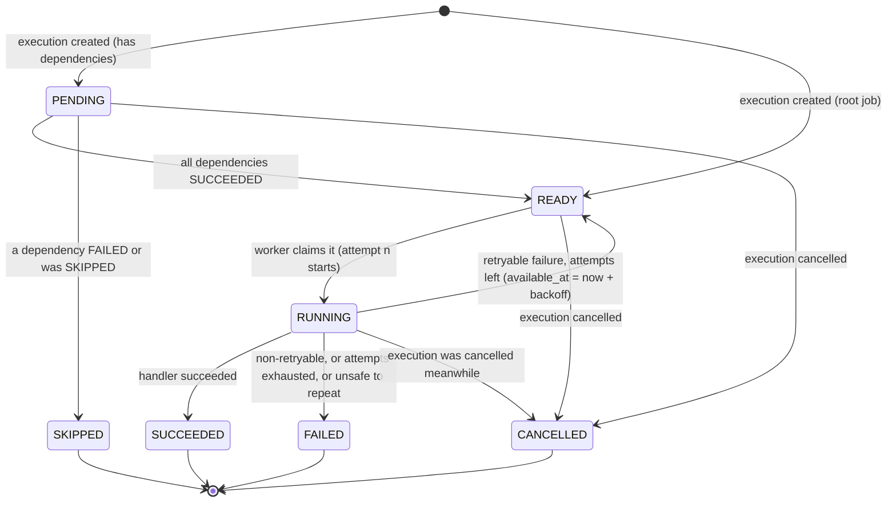
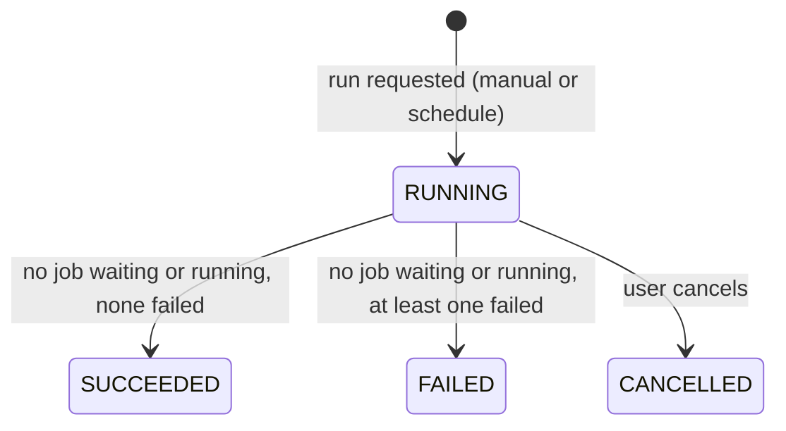

# FlowForge — Execution Engine

| | |
|---|---|
| Related | [FRS.md](FRS.md) · [database.md](database.md) · [api.md](api.md) · [architecture.md](architecture.md) |

This document specifies how a workflow definition becomes jobs, how the worker runs them safely, and how failures are handled.

---

## 1. Principles

1. **PostgreSQL is the queue.** A job is "queued" when its `job_execution` row is `READY`. There is no separate queue system to keep in sync.
2. **Handlers do the work, the engine does the bookkeeping.** An `HttpJobHandler` makes the HTTP call and returns a result. It never touches the database. Only the engine changes job and execution states.
3. **No database transaction is open while a job does I/O.** Every attempt consists of short transactions *around* the work, never *during* it.
4. **Every state change is conditional.** Updates say `WHERE status = 'RUNNING' AND attempt_count = 2`, not just `WHERE id = ?`, so a late or duplicate update changes nothing.
5. **Time comes from the database.** Leases and retry times use PostgreSQL's `now()`, so several machines with slightly different clocks still agree.

---

## 2. Workflow model

A workflow is a **directed acyclic graph** (DAG) of steps:

```text
A ──→ B ──→ D          B depends on A and C
      ↑                D depends on B
C ────┘                A and C have no dependencies ("roots")
```

- **Roots** (A, C) can start immediately and run in parallel.
- **B** starts only after **both** A and C have succeeded.
- **D** starts after B has succeeded.
- One valid order is A, C, B, D (a *topological order*).

**Cycles are forbidden.** With A → B → A, neither step could ever start and the execution would hang forever. A cycle can't be prevented by a database constraint because it's a property of the whole graph, so `WorkflowGraph` checks it in Java (depth-first search) whenever dependencies change, and returns the cycle path for the error message.

**Concurrent edits:** two browser tabs could add A→B and B→A at the same moment. Each change is fine on its own, but together they form a cycle. To prevent this, the service **locks the workflow row** (`SELECT … FOR UPDATE`) before loading the graph, validating and saving. The second request waits, then sees the first request's edge and is rejected. (This is *write skew*: two transactions each check a rule and both pass, because neither sees the other's write.)

**References must point upstream.** If D's config uses `{{steps.B.output.body.id}}`, then B must be an ancestor of D, meaning a direct or indirect dependency. Only then is B guaranteed to have finished before D starts. This is checked at activation.

---

## 3. States

### 3.1 Why these job states

| Candidate state | Decision | Reason |
|---|---|---|
| `PENDING` | **Keep** | Waiting for dependencies |
| `READY` | **Keep** | May be picked up once `available_at <= now()` |
| `RUNNING` | **Keep** | Claimed by a worker |
| `SUCCESS` | **Keep, as `SUCCEEDED`** | Past tense, consistent with `FAILED` and `CANCELLED` |
| `FAILED` | **Keep, as the final failure** | "Failed and will not be retried". This is what messaging systems call a **dead letter**. The "dead-letter list" in the UI is simply `status = FAILED`. |
| `RETRYING` | **Remove** | A job waiting to retry is just `READY` with a future `available_at`. The UI derives "retry 2/3 in 8 s" from `attempt_count > 0` and `available_at > now()`. One claimable state keeps the claim query and the state machine simpler. |
| `DEAD_LETTER` | **Merge into `FAILED`** | Two terminal failure states would need two rules for the same situation |
| `CANCELLED` | **Keep** | The user stopped the execution |
| — | **Add `SKIPPED`** | A job that can never run because an upstream job failed. Without it, those jobs would stay `PENDING` forever and the execution could never finish. |

### 3.2 Job states (final: 7)



| Transition | Caused by | Persisted as |
|---|---|---|
| → `PENDING` / `READY` | Creating the execution | Insert job. Roots get `READY`, `available_at = now()` (+ duration for DELAY). |
| `PENDING` → `READY` | A dependency succeeds and now *all* dependencies have succeeded | Update status + `available_at` |
| `PENDING` → `SKIPPED` | A dependency failed (propagated to all downstream jobs) | Update status + `finished_at` |
| `READY` → `RUNNING` | Worker claim | Status, `locked_by`, `lease_expires_at`, `attempt_count + 1`, plus a `job_attempt` row. One transaction. |
| `RUNNING` → `SUCCEEDED` / `READY` / `FAILED` / `CANCELLED` | Worker records the outcome, or the recovery task finds an expired lease | Conditional update (§6.3). Attempt row closed. Dependents updated. Maybe the execution finishes. One transaction. |
| `PENDING`/`READY` → `CANCELLED` | User cancels | Bulk update in the cancel transaction |

**Invalid transitions** are rejected in Java (the enum lists allowed targets) and, where possible, by database `CHECK`s. Examples: `PENDING → RUNNING` (skipping the dependency check), `SUCCEEDED → anything`, `FAILED → READY` (no "resume" in the MVP).

### 3.3 Execution states (final: 4)

| State | Meaning |
|---|---|
| `RUNNING` | Created. Some jobs are waiting or running. |
| `SUCCEEDED` | All jobs succeeded |
| `FAILED` | Nothing more can run, and at least one job `FAILED` |
| `CANCELLED` | The user cancelled it |



**Why no `PENDING` execution state:** it would only mean "created, but no job claimed yet". Tracking that needs an extra update in the claim path and helps nobody, because the job list already shows "waiting for a worker". Why no `CANCELLING`: see §10.

### 3.4 Attempt states (4)

`RUNNING` → `SUCCEEDED` | `FAILED` | `ABANDONED`. `ABANDONED` means the worker disappeared (lease expired), so **the outcome is unknown**. That's different from `FAILED`, where we know it didn't work (§9).

---

## 4. Execution lifecycle

```text
POST /executions ─► Create execution + one job per step (copy)  ─┐ one transaction
                    Roots → READY, others → PENDING               ─┘
                           │
                           ▼
Worker poll ─────► Claim READY jobs (SKIP LOCKED) → RUNNING       ── transaction 1
                           │
                           ▼
                    Run handler (HTTP call / delay) with timeout  ── no transaction
                           │
                           ▼
                    Record outcome under execution lock:          ── transaction 2
                      SUCCEEDED → unlock dependents (PENDING → READY)
                      retryable → READY again, later
                      final failure → FAILED, downstream → SKIPPED
                      nothing left waiting or running → execution SUCCEEDED / FAILED
                           │
                           └──► next poll picks up newly READY jobs
```

### 4.1 Creating an execution

`ExecutionService.start(workflowId, input, idempotencyKey, user)`, in **one transaction**:

1. Load the workflow **with ownership check** and lock its row (`SELECT … FOR UPDATE`). If it's not `ACTIVE` → `409`.
2. If an `Idempotency-Key` was sent and an execution with `dedup_key = 'manual:' + key` exists → return that one (no new run).
3. Re-validate the graph (defense in depth: never start a cyclic graph).
4. `run_number = ++workflow.execution_count`.
5. Insert `workflow_execution` (`RUNNING`).
6. Insert one `job_execution` per step, **copying** its config, limits and dependency keys.
7. Roots → `READY` with `available_at = now()`, or `now() + duration` for DELAY. Other jobs → `PENDING`.

Response: `202 Accepted`. Nothing has run yet.

### 4.2 The worker loop

```text
Worker (one poll thread + a pool of 4 job threads, inside Spring Boot)

every 1 second (and immediately after a job finishes):
    free = 4 - jobsInFlight
    if free > 0:
        jobs = claim(free)                        // transaction 1
        for each job: pool.submit(() -> run(job))

run(job):
    context = { input, execution, steps.<upstream>.output }     // read-only query
    result  = handler.execute(job.config, context), limited by job.timeout
    record(job.id, job.attempt, result)           // transaction 2
```

A **DELAY** job never blocks a thread. Its `available_at` is simply in the future, so it isn't claimable until the time has passed. When a worker finally claims it, it succeeds immediately. A 3-day delay costs nothing but a timestamp.

### 4.3 Placeholder resolution (data passing)

Before calling the handler, string values in the config are resolved against the context:

```text
{{input.customer.email}}                      → "jane@example.com"
{{steps.create_crm_contact.output.body.id}}   → "crm_881"
{{execution.id}}, {{execution.runNumber}}
```

- It's a small resolver written in-house: a regex finds `{{…}}`, and dot paths are walked through the JSON (`items.0.id` for arrays). No template library, and **no expression evaluation**, so user input can't execute code.
- If a JSON body string consists of *only* a placeholder (`"{{steps.a.output.body}}"`), the value keeps its JSON type (object, number). Otherwise it's inserted as text.
- A missing value → `Failure(PLACEHOLDER_MISSING, retryable = false)`.

---

## 5. Claiming jobs: `SELECT … FOR UPDATE SKIP LOCKED`

```sql
WITH picked AS (
    SELECT id
    FROM job_execution
    WHERE status = 'READY' AND available_at <= now()
    ORDER BY available_at
    LIMIT :free
    FOR UPDATE SKIP LOCKED
)
UPDATE job_execution j
SET status           = 'RUNNING',
    locked_by        = :workerId,
    attempt_count    = j.attempt_count + 1,
    lease_expires_at = now() + make_interval(secs => j.timeout_seconds + 60),
    started_at       = COALESCE(j.started_at, now())
FROM picked
WHERE j.id = picked.id
RETURNING j.*;
```

In the same transaction, one `job_attempt` row (`RUNNING`) is inserted per claimed job. Then the transaction commits.

**Why this prevents two workers from running the same job:**

- `FOR UPDATE` row-locks the selected rows. A second worker running the same query at the same moment **skips** rows that are locked (`SKIP LOCKED`) instead of waiting, and takes other jobs.
- After commit the row is `RUNNING`, so it no longer matches `status = 'READY'`.
- `UNIQUE (job_execution_id, attempt_number)` makes a double claim impossible even if a bug slipped through.

With a single application instance and one poll thread, claims wouldn't race. The query costs nothing extra, and it lets multiple instances share the queue **without code changes**. Alternatives considered:

| Alternative | Problem |
|---|---|
| `SELECT` then `UPDATE` without locking | Two workers read the same row and both run it |
| `FOR UPDATE` without `SKIP LOCKED` | Correct, but workers queue up behind each other's locks |
| Optimistic claim (`UPDATE … WHERE status = 'READY'`, check the row count) | Correct, but under contention most workers fight over the same first rows |
| Redis or a distributed lock | Another system to run, and the job state would live in two places |

---

## 6. Recording results and concurrency

### 6.1 The race: two dependencies finish at the same time

B depends on A and C. A and C finish at the same moment on two threads (or two instances):

```text
Thread 1 (A finished)                      Thread 2 (C finished)
BEGIN                                      BEGIN
UPDATE A → SUCCEEDED                       UPDATE C → SUCCEEDED
Are all of B's deps done?                  Are all of B's deps done?
  sees A = SUCCEEDED, C = RUNNING            sees C = SUCCEEDED, A = RUNNING
  → no, leave B PENDING                      → no, leave B PENDING
COMMIT                                     COMMIT
                     → B stays PENDING forever. The execution hangs.
```

Neither transaction is wrong on its own: under PostgreSQL's default isolation (`READ COMMITTED`), neither can see the other's uncommitted change. This is a **lost wakeup**, the central concurrency hazard in dependency release.

### 6.2 The fix: one engine update per execution at a time

Every "record outcome" transaction **starts** by locking the execution's row:

```sql
SELECT id, status FROM workflow_execution WHERE id = :executionId FOR UPDATE;
```

Thread 2 now waits until thread 1 commits. Its following queries run *after* that commit, so it sees A = `SUCCEEDED` and releases B. B is released exactly once.

- **Cost:** updates within *one* execution are serialized for a few milliseconds each. Different executions still proceed fully in parallel.
- **Bonus:** the same lock makes completion detection and cancellation race-free.
- **JPA pitfall:** take the lock **first**. If job entities were loaded before the lock, Hibernate's first-level cache would return stale copies.
- **Lock order** (avoids deadlocks): execution row first, then job rows. The claim query only touches job rows and never waits (it skips locked rows), so it can't be part of a deadlock cycle.

### 6.3 Fencing: ignoring late results

Recording a result is a **conditional** update:

```sql
UPDATE job_execution SET status = 'SUCCEEDED', output = :output, finished_at = now(), …
WHERE id = :jobId AND status = 'RUNNING' AND attempt_count = :attemptNumber;
```

If it updates **0 rows**, this attempt is no longer the current one. For example, the worker was frozen, its lease expired, and the job was retried as attempt 2. The late result is written only to the old `job_attempt` row as a note and changes nothing else. The attempt number acts as a **fencing token**: an old worker can never overwrite newer state.

### 6.4 Transactions per attempt

| # | Transaction | Locks | Duration |
|---|---|---|---|
| 1 | Claim | job rows (skip locked) | milliseconds |
| — | Handler runs | **none** | up to the timeout (HTTP call, etc.) |
| 2 | Record outcome | execution row → job rows | milliseconds |

**Why the handler must never run inside a transaction:** a 30-second HTTP call inside a transaction would hold a database connection and row locks for 30 seconds. Four such jobs would exhaust a small connection pool and block other workers.

### 6.5 Several jobs ready at the same time

- One instance: the poll thread claims up to the number of free pool threads (default 4), and they run in parallel. Extra `READY` jobs wait for the next poll.
- Several instances: each claims different rows thanks to `SKIP LOCKED`. Nothing else changes.
- Order: oldest `available_at` first. There is no fairness between users. A per-user limit would be a Later feature, if it's ever needed.

---

## 7. Retries

### 7.1 Which failures are retried

| `errorType` | Example | Retryable |
|---|---|---|
| `CONNECTION_ERROR` | DNS failure, connection refused (the request was never sent) | Yes |
| `HTTP_5XX` | 500, 502, 503, 504 | Yes |
| `HTTP_429` | Rate limited | Yes |
| `TIMEOUT` | No response within `timeoutSeconds` | Only if the step is **safe to repeat** (§8) |
| `HTTP_4XX` | 400, 401, 404: the request itself is wrong | No |
| `UNEXPECTED_STATUS` | A status outside `expectedStatus` that isn't 4xx or 5xx (for example 200 when the step expects 201) | No |
| `TRANSFORM_ERROR` | The JSONata expression doesn't parse or fails while evaluating (including its time and recursion limits) | No |
| `EMAIL_DEFERRED` | The SMTP server answered 4xx (temporary, for example greylisting), so nothing was accepted | Yes |
| `EMAIL_REJECTED` | The SMTP server answered 5xx (for example an unknown mailbox), or authentication failed | No |
| `OUTCOME_UNKNOWN` | Sending failed in a way that leaves it unclear whether the mail was accepted | Only if safe to repeat (EMAIL never is) |
| `INVALID_CONFIG`, `PLACEHOLDER_MISSING` | Bad URL, missing value | No |
| `OUTPUT_TOO_LARGE` | Response over 256 KB | No |
| `LEASE_EXPIRED` | Worker disappeared (§9) | Only if safe to repeat |
| `UNEXPECTED_ERROR` | Exception in the handler (a bug) | Yes (limited by the attempt count) |

**Rule of thumb:** retry when repeating the same request could plausibly produce a different result.

### 7.2 Backoff

```text
delay after attempt n = min(retryDelaySeconds × 2^(n−1), 600 s)
next available_at     = now() + delay
```

With the defaults (`retryDelaySeconds = 10`, `maxAttempts = 3`), the job is retried after 10 s and then after 20 s. **Why exponential:** if a service is overloaded, hammering it every 10 seconds makes things worse. Growing gaps give it time to recover. (Random jitter, which spreads out retries from many jobs that failed together, is an easy Later improvement.)

### 7.3 Example: fail, fail, succeed

| Time | Event | Job after the event | Attempts |
|---|---|---|---|
| 09:30:00 | Claimed | `RUNNING`, attempt_count 1 | #1 RUNNING |
| 09:30:01 | HTTP 503 → retryable, 1 < 3 | `READY`, available_at 09:30:11 | #1 FAILED |
| 09:30:11 | Claimed | `RUNNING`, attempt_count 2 | #2 RUNNING |
| 09:30:12 | HTTP 503 → retryable, 2 < 3 | `READY`, available_at 09:30:32 | #2 FAILED |
| 09:30:32 | Claimed | `RUNNING`, attempt_count 3 | #3 RUNNING |
| 09:30:33 | HTTP 201 | **`SUCCEEDED`**, output stored, dependents unlocked | #3 SUCCEEDED |

### 7.4 Example: fail, fail, fail → final failure

As above, but attempt 3 also returns 503. `attempt_count (3) == max_attempts (3)`, so:

- the job becomes **`FAILED`** (the dead letter) with `last_error = "HTTP 503 …"`
- every job downstream of it becomes **`SKIPPED`**
- jobs in *independent* branches keep running
- once nothing is waiting or running, the execution becomes **`FAILED`** with `error_summary = "create_crm_contact failed after 3 attempts: HTTP 503"`

The user sees the failed job and all three attempts. The MVP recovery path is **"Run again"** (a new execution). Resuming a failed execution from the failed job is Later (FRS FR-57).

---

## 8. Idempotency

**The problem:** "doing the action" and "recording that it was done" happen in two different systems (the external API and PostgreSQL). No transaction spans both, so a crash can always happen in between:

```text
Worker sends POST /contacts → CRM creates contact crm_881
── worker crashes before recording SUCCEEDED ──
Lease expires → FlowForge sees the job as unfinished → runs it again → second contact!
```

So FlowForge provides **at-least-once execution**: a job may run more than once. Its **result is recorded exactly once** (fencing, §6.3). Making the *side effect* happen only once needs cooperation from the other side. The design handles this in three ways:

| Measure | How |
|---|---|
| **Safe-to-repeat classification** | GET, HEAD, PUT and DELETE are repeatable by HTTP semantics ("set X to Y" twice gives the same result). DELAY and TRANSFORM have no external effects. POST, PATCH and EMAIL are **not** safe to repeat. |
| **No automatic repeat when the outcome is unknown** | After a timeout or a crash (`TIMEOUT`, `LEASE_EXPIRED`), an unsafe step goes straight to `FAILED` with "outcome unknown: check the target system before running again". Guessing wrong could mean two emails or two payments. A human should decide. |
| **Idempotency key header** | Every HTTP request carries `Idempotency-Key: <jobExecutionId>`, the same on every attempt. APIs that support it (Stripe-style) will execute the request only once. Later: a per-step checkbox "this API honors idempotency keys", which would mark a POST step as safe to repeat. |

**Designing steps to be safe:** prefer "set" over "add". For example, `PUT /accounts/{{execution.id}}` (creates-or-replaces the same account) instead of `POST /accounts` (creates a new one each time). Example 2 in the FRS does exactly this.

**Duplicate *execution requests*** (double-clicking "Run", or a browser retry) are a separate problem, solved at the API level: the client sends an `Idempotency-Key`, and a unique constraint on `(workflow_id, dedup_key)` makes a second insert impossible. The API then returns the existing execution.

---

## 9. Crash recovery: leases

**Problem:** a worker claims a job and then the process is killed. No one will ever record a result, so without recovery the job stays `RUNNING` forever.

**Solution: a claim expires.** On claim, `lease_expires_at = now() + timeoutSeconds + 60 s`.

- A healthy worker always finishes (or times out) before the lease expires, because the handler is forcibly stopped at `timeoutSeconds`. The 60 s is slack.
- **Recovery task** (every 30 s, in every instance):

```sql
SELECT id, workflow_execution_id, attempt_count
FROM job_execution
WHERE status = 'RUNNING' AND lease_expires_at < now()
LIMIT 50;
```

For each one, a transaction **locks the execution row**, re-checks that the job is still `RUNNING` with the same `attempt_count`, marks the attempt `ABANDONED` (`LEASE_EXPIRED`), and then:

- the execution was cancelled → job `CANCELLED`
- the job is safe to repeat and has attempts left → `READY` (with backoff)
- otherwise → `FAILED` (with "outcome unknown" for unsafe steps)

**Why no heartbeats:** many systems let the worker renew its lease every few seconds. Because every FlowForge attempt has a hard timeout of at most 5 minutes, the lease can simply cover the whole attempt, so there's no heartbeat thread and nothing to renew. The cost is slower detection: up to timeout + 90 s (about 2 min with the default 30 s timeout). That's fine for this project.

**If the worker was only slow, not dead** (for example, it froze for longer than the lease): the recovery task retries the job as attempt 2. When the slow worker later reports attempt 1, fencing (§6.3) discards the result. The external effect may have happened twice, which is why §8 exists.

**Abandoned attempts count against `maxAttempts`.** Otherwise a job that crashes its worker every time (a "poison pill") would be retried forever.

---

## 10. Cancellation

`POST /api/executions/{id}/cancel`, in one transaction under the execution lock:

1. If the execution isn't `RUNNING` → `409`.
2. Execution → `CANCELLED`, `finished_at = now()`.
3. All `PENDING` and `READY` jobs → `CANCELLED`. A DELAY waiting for its time is `READY`, so it's cancelled instantly.
4. Jobs that are `RUNNING` are **not** interrupted. When their worker records the outcome, the engine sees the execution is `CANCELLED`, marks the job `CANCELLED` (the attempt keeps its real result), and unlocks nothing.

**Trade-off (deliberately simple):** for a short time an execution shows `CANCELLED` while one job is still finishing its HTTP call, and that call may complete its effect. A more precise design uses a `CANCELLING` state and interrupts running handlers. That's a later refinement.

**Race: cancel vs claim.** If the claim locked a `READY` job first, the cancel's update waits, then sees `RUNNING` and leaves it for step 4. If cancel went first, the claim skips the locked row, and afterwards the row is `CANCELLED`. Both orders end consistently.

---

## 11. Completion

After every recorded outcome, still holding the execution lock:

```sql
SELECT count(*) FILTER (WHERE status IN ('PENDING','READY','RUNNING')) AS active,
       count(*) FILTER (WHERE status = 'FAILED')                     AS failed
FROM job_execution WHERE workflow_execution_id = :executionId;
```

`active = 0` → the execution becomes `FAILED` if `failed > 0`, otherwise `SUCCEEDED`. There's no background job checking "is it done yet?". Whichever transaction finishes the last job also finishes the execution.

**Invariant that makes this correct:** a `PENDING` job always has at least one dependency that is still `PENDING`, `READY` or `RUNNING`. When a dependency fails, all downstream jobs are marked `SKIPPED` in the same transaction, so nothing waits on something that will never happen.

---

## 12. Scheduling

The scheduler runs as a `@Scheduled` method every 15 seconds, in every instance. For each due schedule, one at a time, each in its own transaction:

```sql
SELECT s.* FROM workflow_schedule s JOIN workflow w ON w.id = s.workflow_id
WHERE s.enabled AND s.next_run_at <= now() AND w.status = 'ACTIVE'
ORDER BY s.next_run_at LIMIT 1
FOR UPDATE OF s SKIP LOCKED;
```

1. `dueAt = next_run_at`.
2. If the workflow already has a `RUNNING` execution → skip this run (and log it).
3. Otherwise create an execution exactly as in §4.1, with `trigger_type = SCHEDULE`, `scheduled_for = dueAt`, `dedup_key = 'schedule:' + id + ':' + dueAt`, and the schedule's input.
4. `last_run_at = dueAt`. `next_run_at = cron.next(now)`, calculated in the schedule's time zone (so "08:00 Europe/Berlin" is correct in summer and winter).

**No duplicates:** two instances can't process the same schedule at once (`SKIP LOCKED`), and even if something went wrong, the unique `dedup_key` rejects a second execution for the same due time.
**After downtime:** the stored due time fires once (one catch-up run), and the next time is computed from *now*, so missed runs aren't replayed one by one.
**Why not Spring `@Scheduled(cron = …)` per workflow?** Those cron expressions are fixed when the app starts, would fire in every instance, and forget everything on restart. User schedules are data, so they live in the database.
**Daylight-saving transitions (tested).** Next run times are calculated on the local wall clock of the schedule's time zone, and each wall-clock time fires at most once. Used directly on zoned times, Spring's `CronExpression` would skip a daily 02:30 run on the day clocks go forward and fire it twice on the day they go back. In FlowForge:

- A time that doesn't exist that day (02:30 when clocks jump from 02:00 to 03:00) runs one hour later, at 03:30.
- A time that happens twice (02:30 when clocks go back from 03:00 to 02:00) runs once, at the first occurrence.
- A schedule that fires more often than hourly skips the repeated hour once a year, because its wall-clock times already fired.

**A workflow that became invalid** while `ACTIVE` (edits are allowed) can't start a scheduled run. The run is skipped and logged, and the schedule moves on to its next time.

---

## 13. Failure scenarios

| Scenario | What happens | State persisted | Retry? | User sees |
|---|---|---|---|---|
| **Worker/app crashes mid-job** | Lease expires, and the recovery task marks the attempt `ABANDONED` | Attempt `ABANDONED`. Job `READY` or `FAILED`. | If safe to repeat and attempts are left | Attempt "worker stopped responding", then a new attempt or a failure saying the outcome is unknown |
| **Duplicate execution request** | Same `Idempotency-Key` → unique `dedup_key` → the existing execution is returned | One execution | — | One run |
| **Scheduler fires twice** (two instances) | `SKIP LOCKED` + unique `dedup_key` | One execution | — | One run |
| **Two workers want the same job** | `SKIP LOCKED`: the second takes a different job | One attempt | — | Nothing unusual |
| **Slow worker reports late** | Fencing: 0 rows updated, and the result is noted on the old attempt | Newer attempt wins | — | Note on attempt 1 |
| **Job timeout** | Handler interrupted at `timeoutSeconds` → `TIMEOUT` | Attempt `FAILED` | If safe to repeat | "Timed out after 30 s" |
| **External API returns 5xx** | Retryable → `READY` after backoff | Attempt `FAILED`, job `READY` | Yes, up to `maxAttempts` | "retry 2/3 in 20 s" |
| **Dependency fails** | Downstream jobs `SKIPPED`. Independent branches continue. | `SKIPPED` rows | No | Grey skipped jobs, execution `FAILED` at the end |
| **Retry exhaustion** | Job `FAILED` (dead letter) | `last_error`, all attempts | No (Run again manually) | Red job with 3 attempts |
| **Cancellation** | §10 | Execution + waiting jobs `CANCELLED` | No | `CANCELLED` immediately |
| **Database unavailable** | API → `503`. The worker poll loop logs, waits 5 s and tries again. Results that can't be recorded are retried 3× over about 30 s, then dropped, and the lease expiry recovers the job. The scheduler catches up next tick. | Last committed state (transactions are all-or-nothing) | Automatic after recovery | Errors in the UI, then everything continues. Possibly one extra attempt. |
| **Cycle created by concurrent edits** | Workflow row lock serializes the edits. The second sees the cycle. | No cycle stored | — | `422 DEPENDENCY_CYCLE` |

---

## 14. Job handlers

```java
public interface JobHandler {
    JobType type();                                              // HTTP, DELAY (later TRANSFORM, EMAIL)
    void validate(JsonNode config);                              // at step save / activation
    default Duration readyDelay(JsonNode config) { return Duration.ZERO; }   // DELAY overrides this
    boolean isSafeToRepeat(JsonNode config);                     // HTTP: depends on the method
    JobResult execute(JsonNode resolvedConfig, JobContext ctx) throws InterruptedException;
}

public sealed interface JobResult {
    record Success(JsonNode output) implements JobResult {}
    record Failure(ErrorType type, String message, boolean retryable) implements JobResult {}
}
```

- Handlers are Spring beans collected into a `Map<JobType, JobHandler>`. Adding a job type means a new class and a new enum value (plus a migration extending the `CHECK`).
- `HttpJobHandler` uses Spring's `RestClient` with connect and read timeouts, sends the `Idempotency-Key`, and turns every outcome into a `JobResult`. It returns failures as values instead of throwing.
- **Later (before public deployment):** block requests to private and internal addresses (`localhost`, `10.x`, `169.254.169.254`, …), because otherwise users could make the server call internal services (SSRF).

---

## 15. Configuration defaults

```yaml
flowforge:
  worker:
    enabled: true
    threads: 4
    poll-interval: 1s
    lease-grace: 60s
  recovery:
    enabled: true
    interval: 30s
    batch-size: 50
  scheduler:
    interval: 15s
  limits:
    max-steps-per-workflow: 30
    max-output-bytes: 262144
    max-retry-delay: 600s
```

---

## 16. How the engine is tested

| Test | Kind | Proves |
|---|---|---|
| `WorkflowGraph`: cycles, topological order, ancestors | Unit | Graph rules |
| Job state transitions: all allowed and forbidden pairs | Unit | State machine |
| Backoff: 10 → 20 → 40, capped | Unit | Retry math |
| Placeholder resolver | Unit | Data passing, missing values |
| Linear and diamond workflows against a stub HTTP server (WireMock) | Integration (Testcontainers) | Ordering, parallelism, completion |
| 200 `READY` jobs, 8 threads claiming concurrently | Integration | No job claimed twice |
| B and C finishing at the same instant (repeated 100×) | Integration | Lost-wakeup fix: D released exactly once |
| Claim, then never report; lease expires | Integration | Crash recovery, `ABANDONED`, unsafe → `FAILED` |
| Report with an old attempt number | Integration | Fencing |
| Two scheduler ticks at the same time | Integration | One execution per due time |

The concurrency tests must run on **real PostgreSQL** (Testcontainers). H2 doesn't implement `SKIP LOCKED` or row locking the same way.

---

## 17. Open decisions

| Decision | Leaning | Revisit when |
|---|---|---|
| Heartbeats vs "lease = timeout + grace" | No heartbeats | If steps ever need timeouts longer than ~5 min |
| `CANCELLING` + interrupting running jobs | Not in the MVP | If the cancel trade-off (§10) bothers users |
| Resume a failed execution | Later | After retries and recovery are stable |
| Per-step "API honors idempotency keys" flag | Later | When an example needs POST retries after timeouts |
| Jitter on backoff | Later | Trivial to add |
